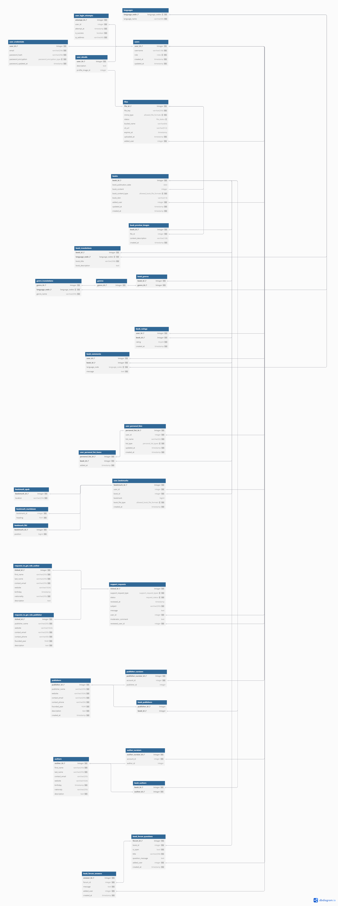

# Bookworm server
## Оглавление
- [Описание](#описание)
- [Используемые технологии хранения данных](#используемые-технологии-хранения-данных)
  - [Схема и описание базы данных](#схема-и-документация-базы-данных)
  - [База данных MySQL 8](#база-данных-mysql-8)
  - [S3-хранилище](#s3-хранилище-для-файлов)
- [Используемые python зависимости](#используемые-python-зависимости)
- [Архитектура проекта](#архитектура-проекта)
  - [Архитектура проекта и её организация](#архитектура-проекта-и-её-организация)
  - [Описание основных директорий](#описание-основных-директорий)
  - [Описание основных файлов](#описание-основных-файлов)
- [Переменные окружения](#переменные-окружения)
  - [Подключение переменных окружения](#подключение-переменных-окружения)
  - [Общие переменные окружения](#общие-переменные-окружения)
  - [Переменные окружения для подключения к MySQL](#переменные-окружения-для-подключения-к-mysql)
  - [Переменные окружения для работы с S3-хранилищем](#переменные-окружения-для-работы-с-s3-хранилищем)
- [Тестирование](#тестирование)
- [Запуск проекта](#запуск-проекта)

## Описание
API-сервер для дипломной работы на тему "Мобильное приложение "Книгочей" с функциями персонализации"

## Используемые технологии хранения данных
### Схема и документация базы данных:
- Структура базы данных доступна в [вики БД](https://dbdocs.io/stretchable.ru/BookWormServerDB?view=table_structure).
- Файл схемы базы данных в формате DBML доступен [здесь](./assets/db/schema_v1.dbml).
- Посмотреть документацию на [DBML](https://docs.dbdiagram.io/).

### База данных `MySQL 8`
База данных в этом проекте предназначена для хранения следующих данных:
- Пользователей
- Персонализированных списков пользователй
- Произведений
- Комментариев
- Сообщений
- Тикетов от пользователей для администрации. 
Например, сообщения об ошибках, запросов на получение роли (`автора/издателя`) для публикации произведений и т.п.
- Путей на файлы в S3 хранилище с указанием их типов, название, ссылок, статуса(`Активный/Удаленный/Временный`) и т.п.
- И других сущностей.

Схема базы данных показана ниже:


### `S3-хранилище` для файлов
S3-хранилище предназначено для хранения следующих файлов:
- Обложек произведений (`jpeg/png/gif`)
- Аватарок пользователей(`jpeg/png/gif`)
- Содержимого произведений в допустимых форматах (`FB2/EPUB`)

## Используемые python зависимости
Полный файл требуемых зависимостей можно посмотреть [тут](./requirements.txt).

Список основных зависимостей:
- **Pydantic** - Для валидации данных.
  - **Pydantic Settings** - Для управления переменными окружения.
- **FastApi** - Для создания API.
- **SQLAlchemy** - Для работы с базой данных `MySQL 8`.
- **Boto3** - Для работы с `S3-хранилищем`.
- **Pytest** - для тестирования.

## Архитектура проекта
### Архитектура проекта и её организация:
Проект структурирован про принципу MVC (Model-View-Controller).

### Описание основных директорий:
#### `app/` - Пакет содержащий сервер
- `api/` - Обработчики HTTP-запросов, подключенные к маршрутам FastAPI.
- `db/` - Управляет подключением к базе данных и сессиям, с использованием SQLAlchemy
- `models/` - ORM-модели для базы данных, описанные с помощью SQLAlchemy.
- `schemas/` - Pydantic-схемы для валидации входных и выходных данных.
- `services/` - Контроллеры для работы с БД (Бизнес-логика).
- `storage/` - Контроллер для работы с файлами. 
  Поддерживает CRUD-операции над файлами из `S3` или `локального` хранилища.
- `utils/` - Утилиты
    Содержит вспомогательные функции, классы и данные.
#### `tests/` - Содержит тестовые кейсы для модулей. 
Организация тестовых кейсов:
- `test_api/` - Для тестирования api-маршрутов.
- `test_services/` - Для тестирования контроллеров.
- `test_storage/` - Для тестирования хранилища.
- `test_orm/` - Для тестирования ORM модели базы данных 

`conftest.py` - Для настройки тестовой среды. 

### Описание основных файлов:
- `requirements.txt` - Содержит список библиотек, необходимых для работы сервера.
- `.env` - Файл переменных окружения. Содержит конфигурационные параметры сервера.

- `main.py` - Точка входа FastApi-сервера.


## Переменные окружения
Посмотреть пример файла переменных окружения можно [тут](./.env.example)
### Подключение переменных окружения
Для настройки переменных окружения, необходимо создать файл `.env` в директории проекта,
затем используя пример [.env.example](./.env.example), задать в созданном файле необходимые переменные.
Описание переменных окружения, можно посмотреть ниже.

### Описание переменных окружения
#### Общие переменные окружения:
 - **ENVIRONMENT** - Тип текущего окружения:
   - *development* - Для локальной разработки.
   - *release* - Для запуска в контейнере.
 - **SERVER_HOST** - IP-адрес на котором запускается сервер.
 - **SERVER_PORT** - Порт на котором сервер слушает входящие запросы.
 - **USE_S3** - Использовать ли S3 или локальное хранилище (`true/false`).


#### Переменные окружения для подключения к MySQL:
 - **MYSQL_HOST** - Адрес сервера MySQL .
 - **MYSQL_PORT** - Порт на котором работает MySQL.
 - **MYSQL_USER** - Имя пользователя для подключения к базе данных.
 - **MYSQL_PASSWORD** - Пароль пользователя для аутентификации.
 - **MYSQL_DBNAME** - Имя базы данных для подключения.

#### Переменные окружения для работы с S3-хранилищем:
 - **S3_URL** - URL-адрес S3 сервиса.
 - **S3_BUCKET_NAME** - Имя S3-бакета.
 - **S3_ACCESS_KEY** - Ключ доступа к S3.
 - **S3_SECRET_ACCESS_KEY** - Секретный ключ доступа к S3.
 - **S3_REGION** - Регион в котором находиться S3-бакет.
 - **S3_PROJECT_PREFIX** - Директория внутри S3-бакета, в которой хранятся файлы, относящиеся к этому проекту.

#### Переменные окружения для авторизации на сервере
- **JWT_SECRET_KEY** - Секретный ключ, для подписи JWT-токенов.
- **JWT_ALGORITHM** - Алгоритм хеширования.
- **JWT_ACCESS_TOKEN_EXPIRE_MINUTES** - Время жизни access-токена.

#### Переменные окружения для локального хранилища
- **LOCAL_STORAGE_PATH** - Путь до хранилища на локальном устройстве.

## Тестирование
Для запуска тестов необходимо загрузить зависимости из [requirements.txt](./requirements.txt),
настроить [переменные окружения](#переменные-окружения),
перейти в директорию проекта и выполнить следующую команду:

```
$ pytest
```
В результате выполняться все тесты из директории `tests/`.

## Запуск проекта
Раздел пока не написан.